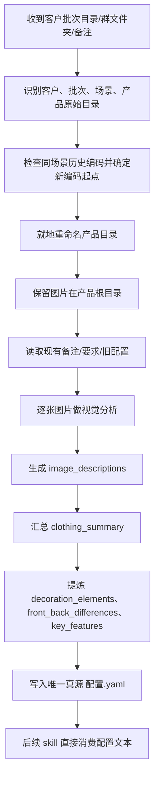
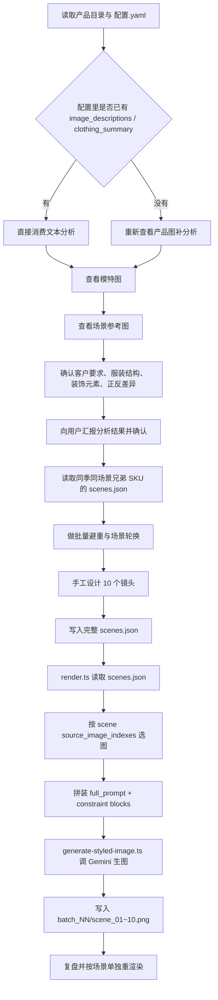

# Legacy Skills Flow And Gap Analysis

## 目的

这份文档用于还原两个 legacy skills 的真实完成流程，并对照当前 `image-task-queue` 实现，明确缺失逻辑与抽象错误。

分析对象：

- `.agent/skills/organize-product-folders/SKILL.md`
- `.agent/skills/styled-clothing-shoot/SKILL.md`
- `.agent/skills/styled-clothing-shoot/scripts/render.ts`
- `.agent/skills/styled-clothing-shoot/scripts/generate-styled-image.ts`
- `.agent/skills/styled-clothing-shoot/scripts/product-config.ts`
- `src/lib/ai-task-lifecycle.ts`
- `workers/src/handlers/style-analysis.ts`
- `workers/src/handlers/image-generation.ts`
- `workers/src/lib/legacy-product-config.ts`
- `workers/src/queue.ts`

---

## 一、Legacy Flow A: `organize-product-folders`

### 核心职责

这个 skill 不是“顺手补几个 legacy 字段”。

它的职责是把客户原始资产整理成后续链路可以直接消费的标准化产品目录，并生成唯一真源 `配置.yaml`。后续 `styled-clothing-shoot` 默认消费这个配置，而不是重新从零组织资产。

### 输入

- 客户原始批次目录
- 场景目录
- 产品原始文件夹名
- 图片文件
- 客户备注文件
- 已有 `配置.yaml` 或旧 `要求.yaml`

### 输出

- 就地整理后的标准产品目录
- 规范化产品编码
- 完整 `配置.yaml`
- 保留原始图片与备注文件

### 完整流程



### `配置.yaml` 在 legacy 流程中的地位

`配置.yaml` 不是可选补充字段，而是后续链路的 authoritative config。

它至少承载这些信息：

| 类别 | 字段 |
|------|------|
| 客户/批次 | `product_code` `client` `season` `scene` `folder_requirements` |
| 选图 | `selected_images` `selected_image_notes` |
| 模特/要求 | `model_image` `custom_requirements` |
| 每图分析 | `image_descriptions[]` |
| 服装总纲 | `clothing_summary.category` `color` `fabric` `silhouette` `length` `key_features` |
| 前后差异 | `front_back_differences` |
| 装饰元素 | `clothing_summary.decoration_elements[]` |
| 运维说明 | `notes[]` |

### 这个 skill 真正交付的关键产物

不是“把目录改整齐”。

它交付的是一份已经完成文本化服装理解的 `配置.yaml`。这意味着下游流程可以优先消费：

- 所有源图的角色定义
- 正反面差异
- 细节元素位置
- 装饰元素形态
- 客户文件夹名里的具体要求

也就是说，legacy 链路里真正的“风格分析前置”其实发生在这个 skill，而不是后面的 worker。

---

## 二、Legacy Flow B: `styled-clothing-shoot`

### 核心职责

这个 skill 不是“拿几张图拼一个 prompt 去生图”。

它的职责是：

1. 基于 `配置.yaml`、模特图、场景参考图、产品图，完成服装销售视角的结构理解。
2. 为单个 SKU 设计一份完整的 `scenes.json`。
3. 再通过渲染脚本逐场景生成图片。

### 输入

- 产品目录
- `配置.yaml`
- 模特参考图
- 场景参考图
- 历史兄弟 SKU 的 `scenes.json`

### 输出

- `生成/batch_NN/scenes.json`
- `scene_01.png ~ scene_10.png`

### 完整流程



### 这个流程的关键不是“生成 10 张图”

关键是中间有一个明确的 scene planning phase：

- 先理解衣服
- 再设计 10 个镜头
- 再渲染镜头

`scenes.json` 才是 legacy 生图链路的真源。

### Legacy `scenes.json` 的关键结构

| 层级 | 关键字段 |
|------|----------|
| `metadata` | `clothing_images` `source_image_notes` `product_config` `model_image` `output_dir` `batch_diversity_context` |
| 顶层语义 | `clothing_description` `scene_name` |
| 单场景结构 | `id` `shot_name` `scene_type` `scene_family` `micro_location` `diversity_reason` |
| 镜头规划 | `framing` `pose` `lighting` `background` `model_direction` `color_tone` `crop_focus` |
| 输入约束 | `source_image_indexes` |
| 结构保护 | `required_details` `front_required_details` `back_only_details` `bottom_required_details` `forbidden_details` |
| 渲染控制 | `render_goal` `seed` `full_prompt` |

### 10 镜头是固定结构，不是数量参数

legacy skill 固定要求：

- 1-5 是全身图
- 6-10 是近景或拼图
- 50% 全身，50% 近景
- 每个镜头职责不同
- 正反面、上半身、下半身、鞋履、拼图都有明确分工

所以 legacy 的“10 张”不是 `targetCount=10` 这么简单，而是一个严格定义的销售镜头体系。

### 渲染阶段的真实逻辑

渲染不是把统一 prompt 跑 10 次，而是：

1. `render.ts` 读取 `scenes.json`
2. 按每个 scene 的 `source_image_indexes` 选择服装源图子集
3. 自动拼接：
   - `full_prompt`
   - `framingConstraint`
   - `render_goal`
   - `required_details`
   - `front_required_details`
   - `back_only_details`
   - `bottom_required_details`
   - `forbidden_details`
4. `generate-styled-image.ts` 再把：
   - 模特图
   - 源图
   - 图序说明
   - 完整 prompt
   一起送给 Gemini
5. 输出到本地 `scene_XX.png`

这说明 legacy 链路的真实“生成控制粒度”是 scene-level，不是 task-level。

---

## 三、当前 `image-task-queue` 实现的真实流程

### 当前流程图

```mermaid
flowchart TD
  A[POST /api/products/:id/submit] --> B[冻结积分]
  B --> C[创建 aiGenerationTask]
  C --> D[插入 task_queue: style_analysis]
  D --> E[worker claimTask(style_analysis)]
  E --> F[解析少量 legacy 字段]
  F --> G[对 selectedImages 或 sourceImageUrls 做简化视觉分析]
  G --> H[写 productSourceImages.analysis/analyzedAt]
  H --> I[插入 task_queue: image_generation]
  I --> J[worker claimTask(image_generation)]
  J --> K[把 source images + model image + generic prompt 发给 Gemini]
  K --> L[按 targetCount 循环生成]
  L --> M[上传 R2]
  M --> N[写 productGeneratedImages]
  N --> O[aiGenerationTask = completed]
  O --> P[结算积分]
  P --> Q[product = reviewing]
```

### 当前实现里真正有的 legacy 兼容

只有这些：

- `productConfigPath`
- `selectedImages`
- `selectedImageNotes`
- `modelImage`
- `customRequirements`

而且兼容方式只停留在“把这些字段传进生成 payload”，不是还原 legacy workflow。

### 当前实现的抽象中心

当前代码把流程抽象成：

- 先做一次通用 style analysis
- 再做一次批量 generic image generation

这和 legacy 的抽象中心完全不同。

legacy 的抽象中心其实是：

- 先完成 authoritative config
- 再做服装级语义理解
- 再做 10-shot scene planning
- 最后逐 scene 渲染

---

## 四、Gap Analysis: 当前流程缺失与错误抽象

### 1. 缺少 `organize-product-folders` 整个前置产物层

| legacy 需要的能力 | 当前状态 | 结果 |
|-------------------|----------|------|
| 就地整理目录、编码、保留备注 | 缺失 | 当前链路没有 authoritative product folder state |
| 生成完整 `配置.yaml` | 缺失 | 当前链路没有 authoritative config source |
| 全量 `image_descriptions` | 缺失 | 当前后续无法基于文本消费所有图片语义 |
| `clothing_summary` | 缺失 | 当前没有统一服装结构总纲 |
| `decoration_elements` | 缺失 | 当前无法稳定保护装饰元素位置/形态 |
| `folder_requirements` | 缺失 | 客户文件夹级要求没有进入当前主链路 |

说明：

当前 `workers/src/lib/legacy-product-config.ts` 只解析了：

- `productConfigPath`
- `selectedImages`
- `selectedImageNotes`
- `modelImage`
- `customRequirements`

它根本没有消费：

- `folder_requirements`
- `image_descriptions`
- `clothing_summary`
- `front_back_differences`
- `decoration_elements`

这意味着当前所谓“兼容 legacy 配置”，只兼容了 legacy config 的一小部分选图字段，没兼容它最关键的语义部分。

### 2. 当前 `style_analysis` 的任务定义是错位的

legacy 里真正需要的不是抽象风格标签，而是服装商品语义理解。

当前 `workers/src/handlers/style-analysis.ts` 输出的是：

- `sceneTags`
- `styleTags`
- `colorPalette`
- `composition`

这类信息对“卖衣服”帮助有限，却缺少真正关键的商业语义：

- 每张图的角色
- 品类、面料、长度、廓形
- 前后差异
- 腰部/领口/袖口结构
- 装饰元素名称、位置、形态
- 哪些细节只能出现在正面/背面

所以当前 style analysis 不是 legacy 里的“服装理解阶段”，而是另一个抽象层级的轻量视觉标签提取。

### 3. 缺少用户确认的服装分析阶段

legacy skill 明确要求：

1. 输出中文分析结果
2. 包含装饰元素清单
3. 用户确认后再继续场景设计

当前 worker 完全没有这个确认环节，直接自动进入生成。

这会直接导致：

- 错误结构被继续传播到生成阶段
- 正反面元素串位无法在 scene planning 前被发现
- 客户要求没有确认闭环

### 4. 缺少批量避重逻辑

legacy 要求同季同场景连续生成时，必须读取最近 4-8 个兄弟 SKU 的 `scenes.json`，做：

- hero 场景骨架避重
- micro-location 避重
- 道具组合避重
- 相邻 SKU 场景方案编号避重

当前实现完全没有读取历史兄弟 SKU 的任何生成资产，也没有任何 batch diversity context。

这意味着当前系统即使能生图，也无法复现 legacy 的批量生产策略。

### 5. 缺少 `scenes.json` 这个核心中间层

这是当前实现最致命的缺口。

legacy 的核心中间产物是 `生成/batch_NN/scenes.json`。

当前实现没有：

- `scene_name`
- `clothing_description`
- `scene_family`
- `micro_location`
- `diversity_reason`
- `pose`
- `lighting`
- `background`
- `model_direction`
- `color_tone`
- `crop_focus`
- `source_image_indexes`
- `render_goal`
- `required_details`
- `front_required_details`
- `back_only_details`
- `bottom_required_details`
- `forbidden_details`
- `seed`
- `full_prompt`

没有这个中间层，就不存在 legacy 流程里的“镜头级规划”。

### 6. 当前不是 10 镜头销售结构，而是 `targetCount` 循环

legacy 的 10 张图是固定销售镜头体系。

当前 `workers/src/handlers/image-generation.ts` 的逻辑是：

- `count = Math.min(targetCount, 20)`
- 用一个通用 prompt builder
- 循环 `count` 次

这只是数量循环，不是镜头设计。

因此当前缺失：

- 固定的 5 全身 + 5 近景结构
- 正反面固定职责
- 下装/鞋履/拼图职责
- `framing = full_body / close_up`
- 镜头级 crop 规则

### 7. 当前没有 scene-level 的源图分流

legacy 渲染阶段按 scene 的 `source_image_indexes` 精确选图。

例如：

- 正面场景只喂正面图
- 背面场景只喂背面图
- 下装场景只喂下装与细节图

当前实现里，`image_generation` 直接把同一组 `sourceImageUrls` 用在所有生成循环里。

这会导致：

- 正反面串位概率升高
- 细节镜头没有正确的输入约束
- 某张图的局部细节无法绑定到特定镜头

### 8. 当前 prompt 组装层远弱于 legacy 渲染链路

legacy 渲染 prompt 的组成是：

- `full_prompt`
- framing constraint
- render goal
- required details
- front-only / back-only details
- forbidden details
- source image role notes
- model identity rules

当前 `buildPrompt()` 只有：

- 产品基础信息
- `styleAnalysis` 的 JSON 串
- `customRequirements`
- 一些通用摄影句子

这意味着当前缺失：

- scene-specific full prompt
- hard negative constraints
- per-shot structure constraints
- scene-level crop instructions
- scene-level validation/final mode
- 正反面错误防御块

### 9. 当前没有 legacy 的“验证图 -> 成片图”节奏

legacy 里 `render_goal` 明确区分：

- `validation`
- `final`

即先验证服装结构，再追求场景氛围。

当前 worker 没有这一层控制，所有生成都直接走成片式 prompt。

### 10. 当前输出形态与 legacy 资产管理不一致

legacy 输出：

- 本地 `生成/batch_NN/scenes.json`
- 本地 `scene_01~10.png`
- 支持单场景重渲染

当前输出：

- `productGeneratedImages`
- R2 URL
- 无本地 batch 目录
- 无 `scenes.json`
- 无单场景重渲染入口

这说明当前系统不是 legacy 流程的队列化版本，而是另一套新的生成系统。

### 11. 当前只兼容了 legacy 的“输入字段”，没有兼容“流程语义”

当前实现复用了：

- `selectedImages`
- `selectedImageNotes`
- `modelImage`

但没复用 legacy 真正重要的流程语义：

- authoritative config maintenance
- clothing semantic extraction
- user confirmation
- batch diversity
- 10-shot planning
- scene-level render orchestration
- rerender loop

所以当前不是“旧流程接进 worker”，而是“把旧流程里的少数字段喂给了一个新流程”。

---

## 五、结论

### 结论 1

当前 `image-task-queue` 实现并没有复现 `organize-product-folders + styled-clothing-shoot` 的完成流程。

### 结论 2

当前实现最大的错误不是“少几个字段”，而是流程抽象错了。

legacy 的核心抽象是：

1. 先生成 authoritative `配置.yaml`
2. 再做服装销售语义理解
3. 再做 10-shot `scenes.json`
4. 最后逐 scene 渲染

当前实现的抽象却是：

1. submit
2. generic style analysis
3. generic batch generation

这两个流程不是同一件事。

### 结论 3

如果目标是“队列化 legacy 能力”，正确改造方向应该是：

1. 把 `organize-product-folders` 的输出模型正式化，至少让 `配置.yaml` 成为真源。
2. 新增 scene planning 阶段，而不是把 style analysis 直接接到 image generation。
3. 让 queue task 至少拆成：
   - `config_preparation` 或 authoritative config sync
   - `clothing_analysis`
   - `scene_planning`
   - `scene_render`
4. `scene_render` 以 `scenes.json` 或等价结构为输入，按 scene 逐张渲染。

在这之前，当前 worker 只能算“新的队列化生图流程”，不能算 legacy 流程迁移完成。
