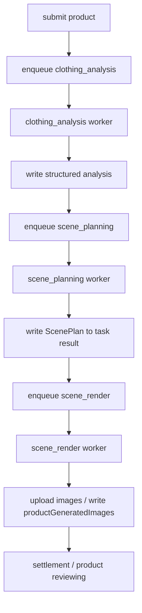

## Context

当前 `image-task-queue` 已经有 DB queue 和 worker 框架，但流程抽象仍然偏离 legacy 业务：

- 它把流程建模成 `style_analysis -> image_generation`
- 它只消费了少量 legacy 字段
- 它没有 `scenes.json`
- 它没有固定 10 镜头规划
- 它没有 scene-level 输入约束与重渲染能力

而旧流程的真实结构是：

1. 先完成服装语义上下文准备
2. 再基于模特图、场景参考语义、兄弟 SKU 历史做 10 镜头规划
3. 先做服装语义理解，再做 10 镜头 scene planning
4. 最后逐 scene 渲染

这次重构目标不是继续给旧的两段式 handler 打补丁，而是把 worker queue 重建成符合 legacy 行为目标的 AI SDK orchestration。

## Goals / Non-Goals

**Goals**

- 使用 AI SDK Core 实现显式、可重复的 structured workflow
- 让数据库中的产品、源图、结构化中间结果成为正式编排输入
- 把执行链路重构为：
  - `clothing_analysis`
  - `scene_planning`
  - `scene_render`
- 产出与 legacy 对齐的 `scenes.json` 或等价结构
- 让渲染以 scene 为粒度而不是以 `targetCount` 为粒度
- 保留现有 `task_queue`、pm2、积分与产品状态流转能力

**Non-Goals**

- 本次不把 `skills` 或本地产品目录当作运行时硬依赖
- 本次不引入消息队列中间件
- 本次不新增单独的 scene 表；优先复用 `task_queue.result`

## AI SDK Framework Choice

根据 AI SDK 官方 workflow patterns，这类“可靠、可重复、需要显式控制状态与阶段输出”的流程，不应使用黑盒 agent loop，而应使用 AI SDK Core 的 structured workflow 组合：

- `generateText`
- `Output.object`
- 明确的 orchestrator-worker 阶段拆分
- 可选的 tool 调用仅用于受控子能力，不承担顶层流程控制

因此本设计采用：

1. `generateText + Output.object` 生成结构化服装分析
   - 默认使用 Gemini 3 Flash 多模态模型处理图片输入与结构化对象输出
2. `generateText + Output.object` 生成结构化 scene plan
3. `generateImage` 逐 scene 渲染

Provider 使用 `@ai-sdk/google`，统一替代当前 `@google/genai` 的直接调用。

## DB-native Inputs

编排从以下数据库上下文开始：

- `products`
- `productSourceImages`
- `aiGenerationTasks`
- `task_queue.payload/result`
- 用户选择的模特 / 风格 / 附加要求
- 历史兄弟 SKU 的 scene plan（由历史任务结果推导）

可选 legacy 字段如 `productConfigPath`、`selectedImages`、`modelImage` 仅作为兼容输入，不作为主真源。

## Queue Architecture

### Task Types

| Task Type | 职责 | 输出 |
|-----------|------|------|
| `clothing_analysis` | 规范化数据库中的产品上下文，补全图片分析与服装总纲，形成结构化服装分析 | `ClothingAnalysisResult` |
| `scene_planning` | 基于服装分析、业务规则与兄弟 SKU 历史，生成 10 镜头 `ScenePlan` | `ScenePlanResult` |
| `scene_render` | 逐 scene 渲染图像并上传 R2，形成可交付结果集 | `SceneRenderResult` |
| `recovery` | 恢复超时任务、退款、更新状态 | `RecoveryResult` |

### Chaining



## Structured Outputs

### `ClothingAnalysisResult`

由 AI SDK `Output.object` 生成，目标是替代当前无业务价值的 `sceneTags/styleTags/colorPalette/composition`。

```ts
type ClothingAnalysisResult = {
  selectedSources: Array<{
    reference: string;
    role: 'front_overall' | 'back_overall' | 'detail' | 'lower_body' | 'flat_lay' | 'other';
    note?: string;
  }>;
  imageDescriptions: Array<{
    file: string;
    role: string;
    description: string;
    visibleDetails: string[];
  }>;
  clothingSummary: {
    category: string;
    color: string;
    fabric: string;
    silhouette: string;
    length: string;
    keyFeatures: string[];
    frontBackDifferences: string;
    decorationElements: Array<{
      name: string;
      position: string;
      location: string;
      form: string;
    }>;
  };
  mustShowDetails: string[];
  frontOnlyDetails: string[];
  backOnlyDetails: string[];
  forbiddenMistakes: string[];
};
```

### `ScenePlanResult`

由 AI SDK `Output.object` 生成，等价于 legacy `scenes.json` 的核心结构。

```ts
type ScenePlanResult = {
  metadata: {
    productId: string;
    aiGenerationTaskId: string;
    scene: string;
    sourceImageIds: string[];
    sourceImageUrls: string[];
    sourceImageNotes: string[];
    modelImageUrl?: string;
    batchDiversityContext: {
      siblingsChecked: string[];
      avoidRepeating: string[];
    };
  };
  clothingDescription: string;
  sceneName: string;
  scenes: Array<{
    id: number;
    shotName: string;
    framing: 'full_body' | 'close_up';
    sceneType: string;
    sceneFamily: string;
    microLocation: string;
    diversityReason: string;
    pose: string;
    lighting: string;
    background: string;
    modelDirection: string;
    colorTone: string;
    cropFocus?: string;
    sourceImageIndexes: number[];
    renderGoal: 'validation' | 'final';
    requiredDetails: string[];
    frontRequiredDetails: string[];
    backOnlyDetails: string[];
    bottomRequiredDetails: string[];
    forbiddenDetails: string[];
    seed: number;
    fullPrompt: string;
  }>;
};
```

## Orchestration Details

### 1. Clothing Analysis Stage

输入：

- `products`
- `productSourceImages`
- 产品业务字段
- 用户附加要求
- 可选 legacy 兼容字段

执行策略：

- 若任务 payload 或历史任务结果中已有完整结构化分析，优先直接归一化，不重复看图
- 若字段缺失或用户明确要求重分析，再使用 AI SDK 读取本地/远程图片补全
- 图片分析模型默认使用 `gemini-3-flash-preview`，可通过环境变量覆盖
- 输出必须是业务结构化服装语义，而不是抽象风格标签

产物：

- task result 中保存 `ClothingAnalysisResult`
- 兼容写回 `productSourceImages.analysis`
- 可选择将摘要写回业务表或任务结果缓存

### 2. Scene Planning Stage

输入：

- `ClothingAnalysisResult`
- 业务规则与场景类型
- 模特参考
- 同季同场景最近 4-8 个兄弟 SKU 的历史 scene plan

执行策略：

- 使用 AI SDK `generateText + Output.object` 直接生成结构化 10 镜头规划
- 不允许只输出数量参数或通用 prompt 列表
- 输出必须区分：
  - 1-5 全身
  - 6-10 近景/拼图
- 输出必须包含 `sourceImageIndexes`、`requiredDetails`、`forbiddenDetails`
- 成功后写入 `task_queue.result`

### 3. Scene Render Stage

输入：

- `ScenePlanResult`

执行策略：

- 按 scene 逐张渲染，不以 `targetCount` 循环
- 使用 AI SDK `generateImage`
- 每个 scene 使用自己的：
  - `fullPrompt`
  - `sourceImageIndexes`
  - `sourceImageNotes`
  - `requiredDetails`
  - `forbiddenDetails`
  - `modelImage`
- 成功结果同时：
  - 上传 R2
  - 写入 `productGeneratedImages`
  - 更新 `aiGenerationTasks` 与任务结果

## Persistence Strategy

### DB

继续复用：

- `task_queue`
- `aiGenerationTasks`
- `productGeneratedImages`
- `productSourceImages`

其中：

- `task_queue.payload` 保存阶段输入
- `task_queue.result` 保存阶段结构化输出

### Filesystem

本地文件系统不作为运行时真源。

如需调试导出，可选将 scene plan 或渲染结果镜像到本地目录，但业务真源仍然是 DB。

## Retry / Failure Semantics

### Clothing Analysis

- 输入缺失、结构化输出无法通过 schema 校验：`permanent`
- 临时网络错误、provider 5xx、超时：`retryable`

### Scene Planning

- scene count 非 10、schema 校验失败、缺关键字段：视为 `permanent`
- provider 5xx / timeout：`retryable`

### Scene Render

- 单 scene 失败允许局部重试
- 同一 scene 超过上限仍失败则记录到任务结果
- 全部 scenes 失败才将整任务判定为 `failed`

## Product Status / Credit Lifecycle

保持业务原则不变：

- submit: `creditsBalance--`, `creditsFrozen++`
- all scenes rendered successfully enough to form deliverable set: `creditsFrozen--`, `creditsTotalSpent++`
- final failed / cancelled: `creditsFrozen--`, `creditsBalance++`

但状态推进改为：

```text
draft
  -> submitted
  -> analyzing
  -> planning
  -> rendering
  -> reviewing
  -> failed / cancelled
```

如果当前 UI 还不支持中间态展示，至少保证 DB 与 SSE 使用这套状态语义。

## Worker Deployment

pm2 维持多 worker 模式，但实例分配调整为：

- `worker-clothing-analysis`: x1
- `worker-scene-planning`: x1
- `worker-scene-render`: x2
- `worker-recovery`: x1

## Risks / Trade-offs

- **Structured output 失败率**：通过 `Output.object` + schema 校验降低脏输出风险，但 prompt 与 schema 需要多轮调优
- **历史多样性依赖任务结果**：batch diversity 依赖历史 scene plan 结果存在，老数据需要补齐或接受降级
- **改造跨度大**：这是对当前错误抽象的纠偏，短期内不能依赖旧测试集全部保持不变
