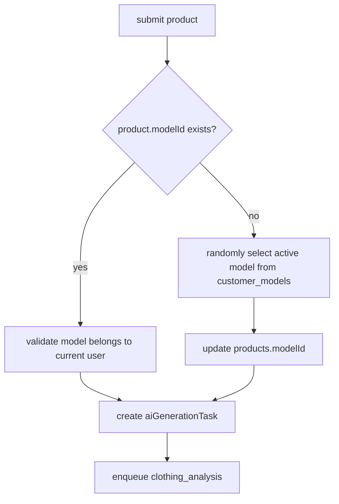

## Context

当前系统已经具备：

- 产品表 `products`
- 源图表 `product_source_images`
- 生成图表 `product_generated_images`
- AI 任务编排链路 `clothing_analysis -> scene_planning -> scene_render`
- R2 文件代理访问 `/api/files/{key}`

现有问题不在“有没有模特输入”，而在“模特输入没有成为正式业务真源”：

- worker 只认识一次性 `modelImage`
- 产品本身不记录已选模特
- 系统没有客户私有模特库

因此本设计把模特从“临时生成参数”提升为“正式业务资产 + 产品绑定关系”。

## Goals / Non-Goals

**Goals**

- 每个客户维护自己的模特库
- 模特图上传到 R2，并通过 `/api/files/...` 访问
- 每个产品永久绑定一个 `modelId`
- 产品首次提交时若未绑定模特，系统自动随机选择一个客户私有模特并写回产品
- 后续所有编排阶段都从产品绑定模特读取图片和描述

**Non-Goals**

- 本次不实现复杂模特筛选 UI
- 本次不做多模特组合生成
- 本次不支持一个产品绑定多个模特

## Data Model

### `customer_models`

新增表：

```ts
customer_models {
  id: varchar(50) primary key
  user_id: varchar(50) not null
  name: varchar(255) not null
  description: text
  image_url: text not null
  file_name: varchar(255)
  file_size: integer
  mime_type: varchar(100)
  is_active: boolean default true
  created_at: timestamptz not null
  updated_at: timestamptz not null
}
```

约束：

- `user_id` 必须为模特归属客户
- 模特不能跨客户共享
- `image_url` 统一存 `/api/files/{key}` 或配置过 `R2_PUBLIC_DOMAIN` 的公开地址

索引：

- `(user_id, is_active, created_at desc)`

### `products`

新增字段：

```ts
products.model_id: varchar(50)
```

语义：

- 表示该产品永久绑定的模特
- 一旦写入，后续该产品所有生成批次都复用

## API Design

### `GET /api/models`

返回当前登录客户自己的模特列表。

### `POST /api/models`

创建一个新模特：

- 接收 `multipart/form-data`
- 包含 `file`、`name`、`description`
- 服务端直接上传到 R2
- 写入 `customer_models`
- 返回创建后的模特记录

R2 Key 规划：

```txt
models/{userId}/{modelId}/{originalFileName}
```

数据库里保存：

```txt
/api/files/models/{userId}/{modelId}/{originalFileName}
```

## Submit Flow



规则：

- 如果 `products.modelId` 已存在，只校验归属客户，不再重选
- 如果不存在，从当前客户 `customer_models` 里随机挑一个 `is_active=true` 的模特
- 如果客户没有可用模特，提交失败

## Worker Changes

### Orchestration Context

`loadOrchestrationContext` 增加：

```ts
selectedModel: {
  id: string;
  name: string;
  description: string | null;
  imageUrl: string;
} | null
```

来源优先级：

1. `products.modelId` 对应的 `customer_models`
2. legacy `payload.modelImage` 仅作兼容回退

### Scene Planning

规划 prompt 新增：

- 模特名称
- 模特描述
- 模特图片 URL

规划结果 metadata 新增：

```ts
selectedModel?: {
  id: string;
  name: string;
  description?: string;
  imageUrl: string;
}
```

### Scene Render

渲染时：

- 主参考模特图来自 `selectedModel.imageUrl`
- prompt 中加入 `selectedModel.description`
- 保持当前“模特图只用于锁定人物身份一致性”的约束

## Compatibility

- 现有 legacy `modelImage` 仍保留兼容，但优先级低于 `products.modelId`
- 已经绑定模特的产品后续重新提交时不重新随机

## Testing Strategy

- schema / migration 测试：新表和新字段存在
- submit 测试：自动绑定、已绑定复用、无模特时报错、客户隔离
- worker 测试：scene planning / render 读取产品绑定模特
- API 测试：模特创建后图片路径为 `/api/files/...`
